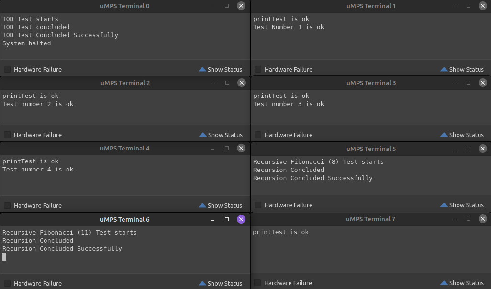

# MicroPandOS

Operating Systems project for uni.  



## General Description

µPandOS is an educational operating system, inspired by the fundamental concepts of operating systems such as PandOSplus and AMIKaya OS.

µPandOS is designed as a microkernel, which means that the core (Nucleus) of the operating system maintains only the essential functionalities, while other services are implemented as separate processes.

The project is structured in **3** phases:

### Phase 1 - Queue Managers (Level 2)

This level focuses on the management of Process Control Blocks (PCBs), which represent processes.

It includes functions for the allocation and deallocation of PCBs, the maintenance of PCB queues, and the management of PCB trees.

It also manages message queues, providing services for the allocation/deallocation of message elements and the maintenance of message queues.

### Phase 2 - Nucleus (Level 3)

The Nucleus receives the control flow from the exception handling of Level 1 and provides a process scheduler to support multiprogramming.

It handles system calls (SYSCALL), device interrupts and timer interrupts.

The Nucleus also provides low-level synchronization primitives and a facility to "pass up" the handling of Program Trap exceptions, TLB exceptions, and certain SYSCALL requests to the Support Level.

### Phase 3 - Support Level (Level 4)

This level adds support for address translation/virtual memory and for character-oriented I/O devices, such as terminals and printers.

It provides exception handlers for TLB exceptions and non-TLB exceptions, creating an environment for the execution of user processes (U-procs).

It introduces the concept of a logical address space for each user process and uses a page table for address translation.

## Testing

The project includes test files to verify the behavior of the code.

## To compile and run

```bash
make
```

```bash
cd testers
make
```

Install and open umps3 (linux only), choose open an existing machine configuration, then select the `umps3.json` file

## Authors

Lorenzo Casalini - <lorenzo.casalini4@studio.unibo.it>

Ivan De Simone - <ivan.desimone@studio.unibo.it>

Michele Cesari - <michele.cesari6@studio.unibo.it>
